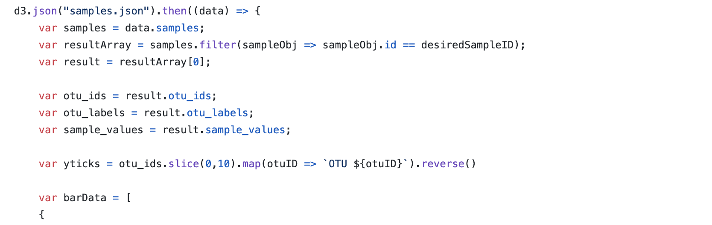
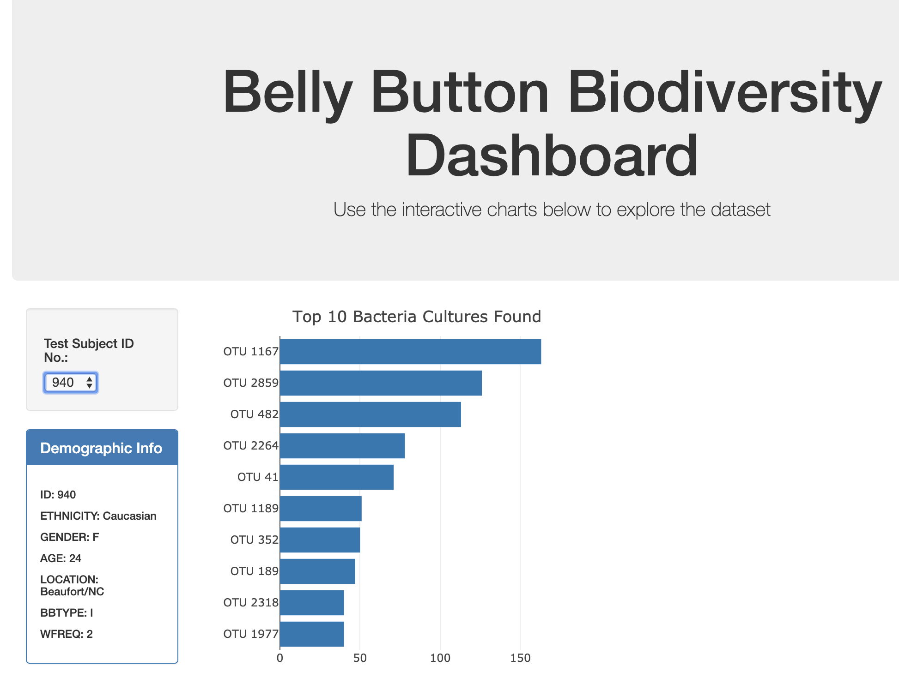
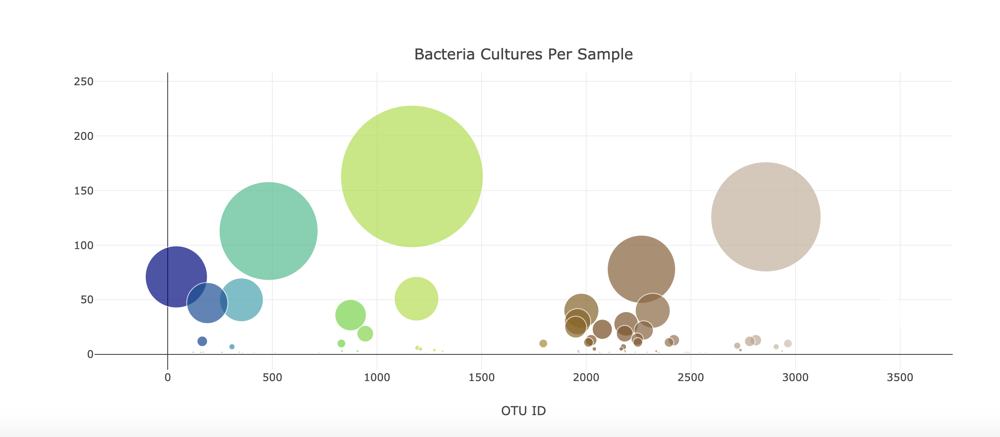

### - Belly Button Biodiversity

### This is an interactive dashboard to explore a data set in JSON. The data set is from a science project called Belly Button Biodiversity. This project was developed in JavaScript using Plotly.JS and D3.JS.

## The below function is used to read in the data from a Json data sample file using d3:

### The below bar graph is generated base on the selected ID from the dropdown and it displays the demographic information along with the graph in a descending order.

### The bubble chart below also display with the selected ID depicting demographic information:

